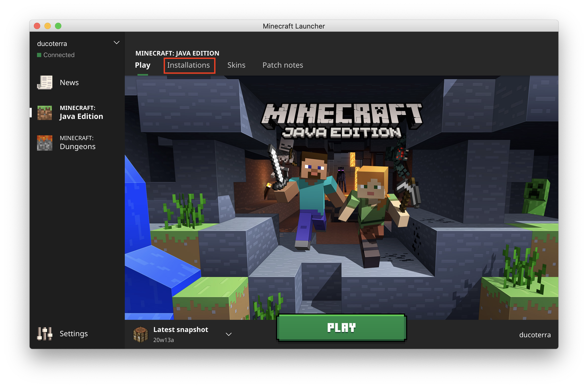
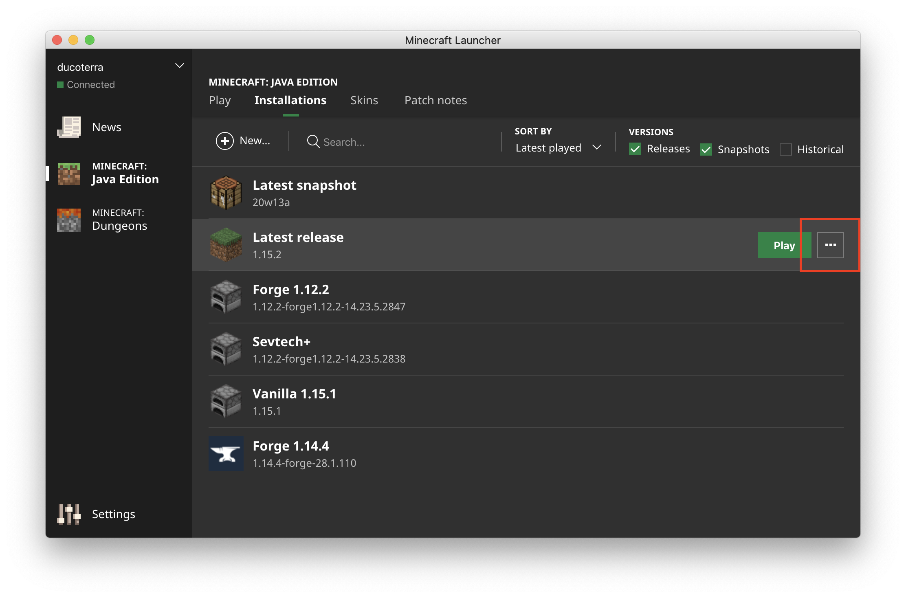
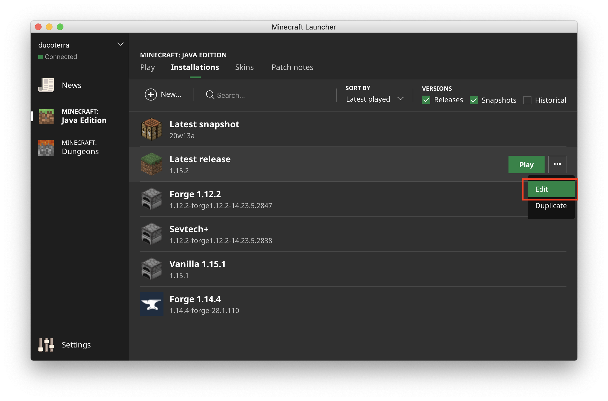
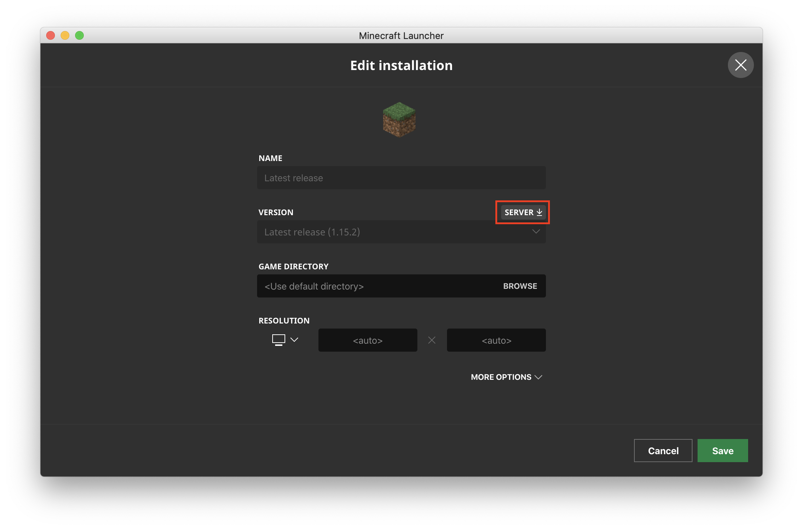

# Minecraft

## Getting server.jar






## Running Locally

```bash
docker-compose build minecraft
docker-compose up minecraft
```

## Uploading to Docker Hub

In docker-compose.yaml, update the image tag to:

```yaml
...
services:
  minecraft:
    build: .
    image: <your_username>/minecraft:<version>-1
    ports:
...
```

then run

```bash
docker-compose push
```

## Running in kubernetes

In k8s/deploy.yaml, edit the deploy

```yaml
...
    spec:
      containers:
      - name: minecraft
        image: <your image from above>
        ports:
...
```

Then run the following

```bash
kubectl apply -f k8s/pvc
kubectl apply -f k8s
```

Your minecraft server will be available on port 25565

## Create a Backup

```bash
kubectl cp <pod_name>:/mc_data <backup>
```

## Restore from Backup

```bash
kubectl cp <backup> <pod_name>:/mc_data
```

## Cool seeds

### 7485786574821478084

Spawns you next to a nether portal with golden axe and pickaxe. River and Village close by.

### -8018833100564192815

Use with an amplified world, massive island
